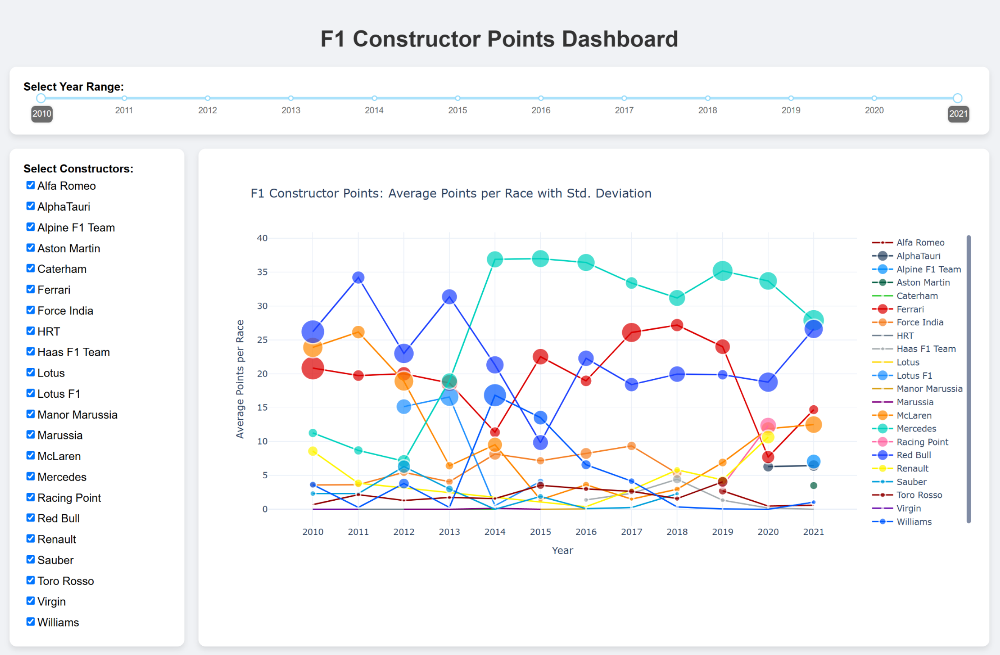
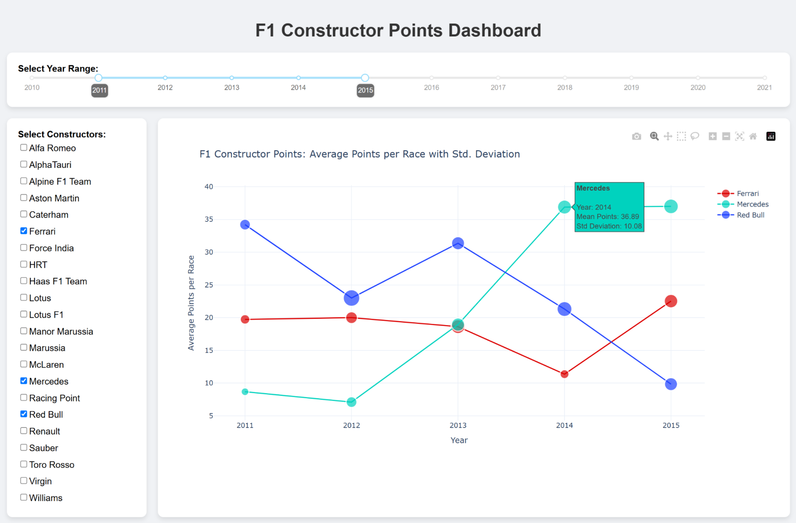

# F1 Constructor Points Dashboard 🏎️🏁

A dynamic dashboard to visualize and explore the average points scored by each F1 team in every season, with standard deviation indicated by bubble sizes.

## Overview 💡

This dashboard provides an interactive visualization of Formula 1 performance data where:

- **X-Axis:** F1 Season 🗓️  
- **Y-Axis:** Average Points per Race 📊  
- **Color Legend:** Each constructor is shown in its traditional color 🎨  
- **Bubble Size:** Reflects the standard deviation of points per race 🔵

Additional interactive features include:
- **Season Selector:** Adjust the year range using a slider. ⏳
- **Constructor Filter:** Select one or more teams using checkboxes. ✔️
- **Hover Information:** Detailed tooltips display team, season, mean points, and standard deviation. 💬

## Data Source 💾

The dashboard uses the **‘Formula 1 Race Data’** dataset from Kaggle.

## Running the Dashboard 🚀

1. **Install Dependencies:**  
   Make sure you have installed all required Python libraries (such as Dash, Plotly, and Pandas). For example, install your dependencies using:

       python -m pip install -r requirements.txt

2. **Run the Application:**  
   Start the dashboard by running:

       python dashboard.py

## Features ✨

- **Interactive Filtering:** Users can select the season range and desired constructors.
- **Responsive Visualization:** The interactive chart updates based on selections.
- **Insightful Tooltips:** Hover over each data point to see detailed statistics.
- **Modern Aesthetic:** The dashboard employs enhanced styling for a clean and responsive design.

## Demonstration Screenshots 📸

This screenshot showcases the main plot with its legend and two interactive selectors—one for choosing the desired seasons and another for comparing constructors.

In the next example, you can see the rise in performance for Mercedes alongside a decline for Red Bull. When selecting the seasons 2011-2015 and filtering for three major constructors, you can observe that in 2014, Mercedes recorded an average of 36.89 points per race with a standard deviation of 10.08.

## Technologies 🛠️

- **Dash & Plotly:** For building the interactive web application and visualizations.
- **Pandas:** For data manipulation.
- **HTML/CSS:** For styling the dashboard components.

## Contributors 👥

- Guillermo Grande Santi
- Jesús Martín Trilla
